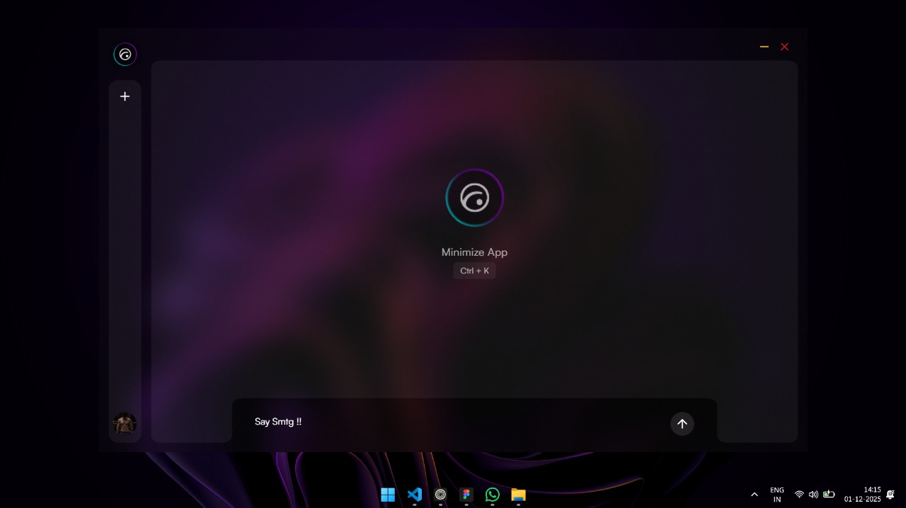
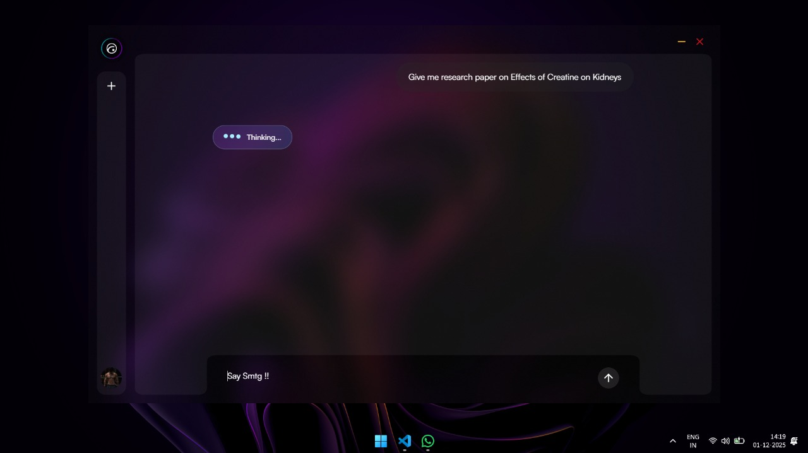
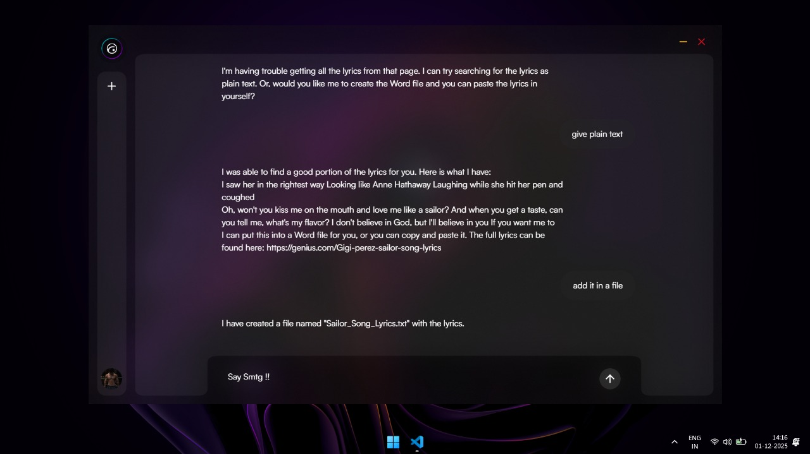
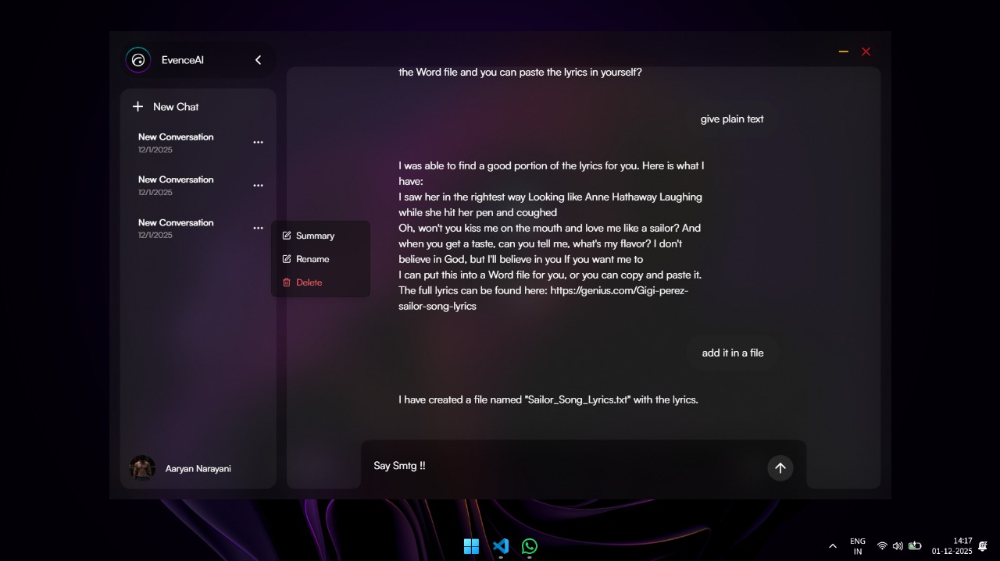

# EvinceAI

[](https://github.com/AaryanNarayani/yellowstone-grpc-tracker)
[](https://www.typescriptlang.org/)
[](https://solana.com/)
[](https://opensource.org/licenses/MIT)

> **A local-first AI operating system layer that lets you command your computer as naturally as you think.**

EvinceAI is a next-generation desktop assistant built to bridge the gap between natural language and your operating system.  
It doesn't just chat it **does**.

Living inside a beautiful, glassmorphic overlay, EvinceAI empowers you to control your computer, manage files, and automate workflows using simple text commands.

---

## Platform Note

EvinceAI is currently **optimized for Windows devices only**.

macOS and Linux support are planned, but native effects and system-level tooling are presently tuned for Windows.

---

## Preview

A glimpse into EvinceAI’s glassmorphic, always-on-top AI OS layer:






> Designed as a lightweight, transparent overlay that feels native to your operating system — fast, fluid, and distraction-free.

---

## Features

- **Glassmorphic UI**  
  A stunning, transparent interface that blends seamlessly with your desktop.  
  Supports Glass, Acrylic, and fully Transparent modes.

- **Agentic Core**  
  Powered by the Vercel AI SDK and OpenRouter, capable of multi-step reasoning and complex task execution.

- **Deep OS Integration**
  - **File System** — Read, write, and manage files directly
  - **Shell Access** — Safely execute terminal commands
  - **Web Search** — Fetch and summarize real-time information from the web

- **Global Shortcuts**  
  Instantly summon your agent using `Cmd + K` (macOS) or `Ctrl + K` (Windows).

- **Local-First by Design**  
  Conversation history and data are stored locally on your machine (`~/.convo`) — no cloud lock-in.

- **Native Visual Effects**  
  Custom native C++ modules (`blurround.node`) enable high-performance window blurring and rounded corners.

---

## Tech Stack

Built using modern, high-performance desktop and web technologies:

- **Runtime**: Electron  
- **Frontend**: React + Vite  
- **Styling**: Tailwind CSS v4 + Framer Motion  
- **AI Engine**: Vercel AI SDK + OpenRouter  
- **Language**: TypeScript  

---

## Getting Started

### Prerequisites

- Node.js (v18+ recommended)
- npm or yarn

---

### Installation

  

1.  **Clone the repository**

```bash

git clone https://github.com/yourusername/Agentic_OS.git

cd Agentic_OS/app/client

```

  

2.  **Install dependencies**

```bash

npm install

```

  

3.  **Configure Environment**

Create a `.env` file in `app/client` with your API keys:

```env

OPENROUTER_API_KEY=your_key_here

SERP_API_KEY=your_serp_key_here

```

  

4.  **Run Development Mode**

```bash

npm run dev

```

  

5.  **Build for Production**

```bash

npm run build

```

  

## Usage

  

1.  **Launch the App**: Run `npm run dev`.

2.  **Summon**: Press `Cmd+K` / `Ctrl+K` to toggle the overlay.

3.  **Interact**:

- "Create a new project folder on my desktop called 'RocketShip'"

- "Search for the latest React docs and summarize the new hooks"

- "Read the package.json in this folder and tell me the version"
